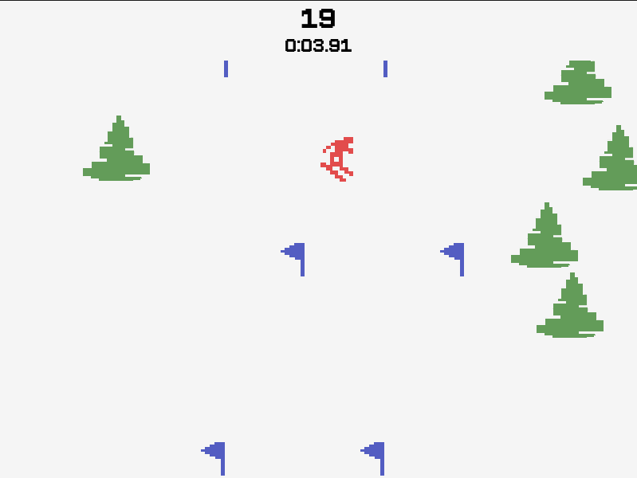

# Skiing

- Unidade Curricular: FPRO/MIEIC, 2020/21
- Autor: André Costa Lima (up202008169)
- Turma: 1MIEIC03

### Objetivos

1. Criar uma adaptação do jogo Skiing do Atari 2600.
2. Adicionar um modo multijogador local ao jogo.
3. Tentar adicionar um modo multijogador online ao jogo.

### Descrição

Da entrada da Wikipédia para [Skiing na Atari 2600](<https://en.wikipedia.org/wiki/Skiing_(Atari_2600)>) lê-se:

> Skiing is a single player only game, in which the player uses the joystick to control the direction and speed of a stationary skier at the top of the screen, while the background graphics scroll upwards, thus giving the illusion the skier is moving. The player must avoid obstacles, such as trees and moguls. The game cartridge contains five variations each of two principal games.
> In the downhill mode, the player's goal is to reach the bottom of the ski course as rapidly as possible, while a timer records his relative success.
> In the slalom mode, the player must similarly reach the end of the course as rapidly as he can, but must at the same time pass through a series of gates (indicated by a pair of closely spaced flagpoles). Each gate missed counts as a penalty against the player's time.

_Neste projeto, não será usado um joystick, mas sim as teclas do teclado para controlar o esquiador._

Adicionalmente, numa fase inicial, será apenas implementado o modo _slalom_.

A nível do possível modo multijogador, a primeira implementação seria de multijogador local e, se houver tempo suficiente, criar um modo multijogador online.

### UI

<p align="center" justify="center">
    <br />
    <strong>Fig 1.</strong> Gameplay em modo <i>slalom</i>.
</p>

### Pacotes

- Python 3.x
- Pygame

### Tarefas

- [x] Obter imagens do cenário e do esquiador em cada uma das direções
- [x] Criar ilusão de movimento do esquiador e possibilitar alteração da direção do mesmo
- [ ] Adicionar animação de voo (não é usada no modo _slalom_)
- [x] Posicionar postes
- [x] Decorar o cenário (árvores e _moguls_)
- [x] Adicionar colisão (obstáculos, postes, ...)
- [x] Adicionar meta e cálculo da pontuação final (penalização de 5? segundos por cada poste perdido)
- [ ] Adicionar menu onde será possível alterar a dificuldade (velocidade e número de postes)

### Execução

Para executar o jogo, são suportados três métodos de execução. Para utilizadores de Nix e/ou de NixOS, o método recomendado é o método "Nix".

#### Nix

Para utilizadores de Nix, é possível executar o jogo, utilizando o seguinte comando:

```bash
nix run github:limwa/skiing
```

#### Python (com venv)

Para executar o projeto dentro de um ambiente virtual de Python, é possível executar os seguintes comandos:

```bash
python -m venv .venv
source .venv/bin/activate

pip install -e .
play_skiing
```

#### Python (sem venv)

Para executar o projeto sem utilizar um ambiente virtual de Python, é possível executar os seguintes comandos:

```bash
python -m pip install -r requirements.txt
python -m skiing
```

### Licença

Este projeto está sob a licença [MIT](./LICENSE).

_Atualizado pela última vez a 08/12/2025_
